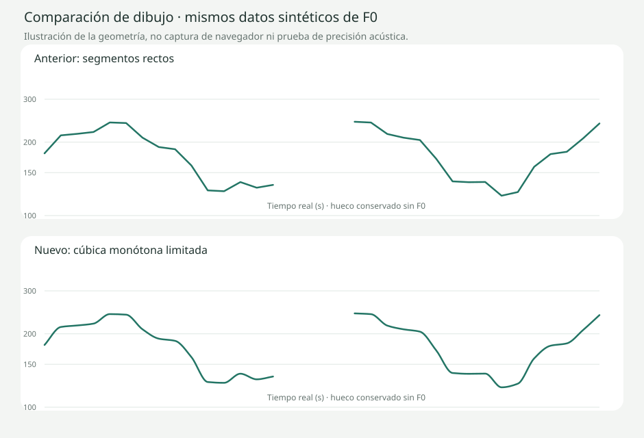

# Experimental live curve rendering (visual only)

## Audit and scope
Based on main f6171daec9d9fbb8c65a2d6816bd5881e6c5e6c1 after merged PR26. Existing Canvas 2D (no chart library) redraws on PCM delivery (~60 ms) with straight segments and a scale that changes per redraw. Detector data, WAV capture and final Praat are separate already. This PR adapts only drawing/scheduling and adds pure geometry helpers; no new dependency.

## Changes
- One requestAnimationFrame chain while recording; stops on completion and pauses when document hidden. One queued callback maximum, no queued per-sample animations. If clock/data do not advance, skip repaint. High-DPI backing retained.
- Eight-second scrolling window driven by a visual clock between audio arrivals; actual elapsed-second labels. 250 ms space to the right; no growing compression. Short initial samples retain existing 0–8 s window, then scroll continuously. Clock advances at most 120 ms beyond the latest received audio and never backwards on late arrivals. No F0 extrapolation is drawn.
- Experimental smooth trace uses monotone Hermite tangents in the existing log-frequency coordinate geometry, harmonic-mean interior tangents, zero tangent at direction changes. Bezier controls clamped within each adjacent pair's frequency bounds. Curves remain within each pair's original extrema. Rounded joins/caps, unchanged measured points.
- Null windows and gaps >120 ms split independent paths. No cubic segment/filter crosses gaps. Existing optional causal median visual filter remains unchanged, reversible and separate from raw data. Final graphs and comparison remain straight/raw as before.
- Live vertical scale fixed to configured detector bounds, preventing entire curve drifting with small changes. Valid detected values within those bounds are not clipped; broader bounds trade stability for less visual excursion. Hz labels retained; no new semitone UI. Guide outside search limits may remain clipped as before and is not a measured F0.
- A/B checkbox inside professional settings switches animated cubic vs straight traces on the SAME points during one recording. Small live Canvas frame/background; no redesign.

## Delay, explicitly limited
Animated mode clips the path at a reveal horizon 100 ms behind the visual capture clock. This is a rendering buffer, not an acoustic measurement or a changed sample timestamp. Straight mode has no reveal buffer. The clock/interpolation tests verify the configured 100 ms horizon and bounded stale behavior, not real microphone latency.

Because detector values refer to centers of 4096-sample windows, latest returned F0 is already about 42.7 ms behind capture end at 48 kHz (46.4 ms at 44.1 kHz). Nominal additional reveal wait vs immediate straight mode is therefore roughly 57.3 ms at 48 kHz / 53.6 ms at 44.1 kHz, plus up to one display frame, when deliveries are regular. Existing median filtering/candidate confirmation have their own unchanged delay. Actual voice-to-screen latency has NOT been measured here; scheduler, device and delivery jitter can add delay. No claim of measured 60 FPS.

## Verification
- `node --check pitch-controller.mjs`: passed. Static frontend has no separate build command; Vercel deployment is the applicable build check.
- `node --test tests/*.test.mjs`: 96 passed, no failures.
- `python -m unittest discover -s tests -p 'test_voice*.py'`: 11 passed, no failures.
- Stable/rising/falling/rapid/extreme F0 interpolation tested at 101 positions per segment: no overshoot, raw arrays unchanged. Null windows and irregular gaps split paths.
- Irregular arrivals, no-backwards clock, bounded stale clock, true elapsed rolling window, resizing/seek, single RAF chain and stopping verified.
- 119 s stored data, 1000 geometry calculations: about 79 ms on this environment; max 135 visible points. This is JavaScript geometry, NOT Canvas paint, browser CPU or device FPS. Complete capture is retained.
- Final engine regression includes synthetic signals, null windows, malformed audio, public human speech and 119 s Praat analysis; no acoustic code changes.

Not executed: real microphone latency, 60 FPS/browser paint profiling, medium-range laptop/mobile CPU/memory, human judgement of the new animation. Preview accessibility is reported in PR. Old Preview required Vercel login. A deployment passing does not verify microphone or visual quality.

## Same-data comparison

SVG is a deterministic illustration from identical points with an unvoiced gap, not a browser screenshot or clinical result. To compare actual live drawing, toggle “Trazado animado suave” in professional settings during the same recording. Data/metrics unchanged.

## Manual preview check
Record ordinary voiced speech, changes and pauses. Check interrupted curves, stable axes and smooth scroll after 8 s. Toggle trace style on the same points, resize the browser, hide/reopen tab, stop/listen/compare attempts. Check import/final and speed workflow remain unchanged. Preview should retain existing FLUIDEZ_VOICE_ENABLED configuration; no new key/variable.
